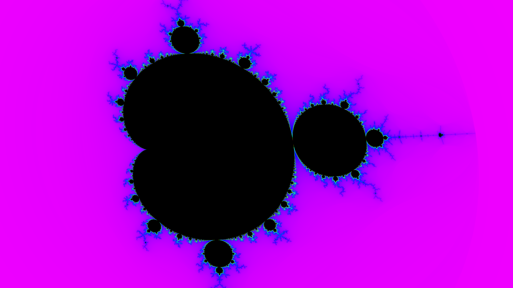

# Mandelbrot Explorer

A high-performance, interactive Mandelbrot set renderer with real-time GPU acceleration, multi-threaded CPU rendering, and an intuitive user interface.

## Features

### 🚀 Triple Rendering Modes
- **GPU Fragment Shader**: Real-time interactive display using OpenGL 3.3+ (50-100x faster than single-threaded CPU)
- **GPU Compute Shader**: High-resolution exports using OpenGL 4.3+ compute shaders (100-1000x faster for exports)
- **CPU Rendering**: Multi-threaded SIMD vectorized computation with dynamic load balancing (16-24x speedup)
- Toggle between modes at runtime to compare performance

### 🎨 Visual Customization
- **External Palette System**: Load custom color palettes from JSON files
- **Smooth Coloring**: Continuous iteration counts for gradient color transitions without banding
- **View Rotation**: Rotate the fractal view by any angle (0-360°)
- Multiple preset palettes included: Classic, Fire, Ice, Ocean, Sunset, Grayscale, Psychedelic

### 🎯 Interactive Navigation
- **Mouse Wheel Zoom**: Smooth zooming centered on cursor position
- **Click to Recenter**: Single-click to center the view on any point
- **Pan with Drag**: Right-click and drag to pan the view
- **Box Zoom**: Shift + drag to select and zoom into a specific region
- **Keyboard Controls**: Arrow keys, Page Up/Down, rotation keys
- **History Navigation**: Browser-style back/forward through your exploration

### 💾 Save and Share
- **Bookmarks**: Save and reload your favorite locations
- **Ultra-Fast GPU Export**: Export up to 16K resolution (132 megapixels) in under 3 seconds
- **Configurable Compression**: Choose speed vs file size with 10 compression levels
- **PNG Format**: Lossless compression with libpng (3.6× faster than original implementation)
- Preset interesting locations included

### 🖥️ Modern UI
- Clean tabbed interface (Controls, Bookmarks, Export)
- Real-time computation time display
- Adjustable iteration counts
- Help overlay (Press F1)

## Controls

### Mouse Controls
| Action | Control |
|--------|---------|
| Zoom In/Out | Mouse Wheel |
| Rotate View | Ctrl + Mouse Wheel |
| Recenter | Left Click |
| Pan View | Right Click + Drag |
| Box Zoom | Shift + Left Click + Drag |

### Keyboard Shortcuts

**Navigation**
| Key | Action |
|-----|--------|
| Page Up | Zoom in |
| Page Down | Zoom out |
| Arrow Keys | Pan view |
| Shift + Arrows | Pan faster |
| `,` (comma) | Rotate counter-clockwise |
| `.` (period) | Rotate clockwise |

**History**
| Key | Action |
|-----|--------|
| Alt + Left | Go back in history |
| Alt + Right | Go forward in history |

**Tabs**
| Key | Action |
|-----|--------|
| Ctrl + 1 | Jump to Controls tab |
| Ctrl + 2 | Jump to Bookmarks tab |
| Ctrl + 3 | Jump to Export tab |

**Other**
| Key | Action |
|-----|--------|
| Ctrl + S | Export image |
| F1 | Toggle help overlay |
| ESC | Quit application |

## Installation

### Prerequisites
- [Odin compiler](https://odin-lang.org/) (nightly build recommended)
- OpenGL 3.3+ support (OpenGL 4.3+ recommended for compute shaders)
- SDL2 development libraries
- libpng development libraries (for optimized PNG export)
- Linux (tested on Arch Linux, should work on other distributions)

### Building

1. Clone the repository:
```bash
git clone https://github.com/anagistics/mandelbrodin.git
cd mandelbrodin
```

2. Compile the stb_image libraries (one-time setup):
```bash
make -C ~/odin-linux-amd64-nightly+2025-10-05/vendor/stb/src
```

3. Build the project:
```bash
odin build . -out:mandelbrodin
```

4. Run:
```bash
./mandelbrodin
```

### Debug Build
For development or troubleshooting:
```bash
odin build . -debug -out:mandelbrodin
```

## System Requirements

**Minimum:**
- CPU: Multi-core processor (2+ cores)
- GPU: OpenGL 3.3 compatible graphics card
- RAM: 2 GB
- OS: Linux

**Recommended:**
- CPU: 8+ core processor with AVX support
- GPU: Modern GPU with hundreds of shader cores
- RAM: 4+ GB
- OS: Linux (Arch, Ubuntu, Fedora, etc.)

## Performance

The application features multiple optimization layers:

### Real-Time Display Performance

| Configuration | Speedup vs Baseline | Techniques |
|--------------|---------------------|------------|
| Single-threaded scalar | 1x (baseline) | Basic loop |
| Multi-threaded scalar | ~6-8x | 8 threads + loop unrolling |
| Multi-threaded SIMD | ~16-24x | 8 threads × 4-wide AVX vectors |
| **GPU Fragment Shader** | **~50-100x** | **Hundreds/thousands of parallel cores** |

### Export Performance (4K Resolution)

| Phase | Export Time | Improvement | Technology |
|-------|-------------|-------------|------------|
| Original | 1959 ms | Baseline | Single-threaded + stb_image_write |
| Phase 1 | 1691 ms | 14% faster | Multi-threaded conversion (8 threads) |
| **Phase 2** | **551 ms** | **72% faster (3.6×)** | **GPU compute + libpng compression** |

**8K Export**: 7711 ms → 2170 ms (72% faster, 3.6× speedup)

## Creating Custom Palettes

Palettes are stored as JSON files in the `palettes/` directory. Create your own by following this format:

```json
{
  "name": "My Custom Palette",
  "description": "A beautiful custom color scheme",
  "stops": [
    {"position": 0.0, "r": 0, "g": 0, "b": 0},
    {"position": 0.5, "r": 255, "g": 128, "b": 0},
    {"position": 1.0, "r": 255, "g": 255, "b": 255}
  ]
}
```

- Positions must be in ascending order from 0.0 to 1.0
- RGB values range from 0 to 255
- Minimum 2 color stops required
- Place the file in `palettes/` and restart the application

## Project Structure

```
mandelbrodin/
├── appelman.odin          # Main application and event handling
├── app/                   # Core application state and logic
├── mandelbrot/            # Computation engines (scalar, SIMD)
├── renderer/              # OpenGL rendering and export
├── visual/                # Palette and coloring systems
├── ui/                    # User interface components
├── shaders/               # GLSL shaders (fragment + compute)
│   ├── mandelbrot.frag   # Fragment shader (real-time display)
│   ├── mandelbrot_compute.glsl  # Compute shader (GPU exports)
│   └── texture.*         # Texture display shaders
├── vendor_libpng/         # libpng bindings for optimized PNG export
├── palettes/              # Color palette definitions (JSON)
└── bookmarks/             # Saved view locations (JSON)
```

## Technical Details

**Rendering Modes:**
- **GPU Display Mode**: Fragment shader (OpenGL 3.3+) computes Mandelbrot in real-time for interactive exploration
- **GPU Export Mode**: Compute shader (OpenGL 4.3+) renders high-resolution exports at 100-1000× speed
- **CPU Mode**: 8-way task parallelism with dynamic work queues and 4-wide AVX SIMD vectorization

**Export Optimization:**
- Multi-threaded ARGB→RGB pixel conversion (8 threads)
- libpng with configurable compression levels (0-9)
- Level 1 compression: 42-44% faster than stb_image_write with similar file sizes
- Combined optimizations: 3.6× faster exports than original implementation

**Coordinate System:**
- Proper rotation support with consistent transformations across GPU and CPU paths
- Screen-to-world coordinate conversion handles zoom, pan, and rotation

**Smooth Coloring:**
- Uses escape distance estimation: `smooth_iter = n + 1 - log(log(|z|)) / log(2)`
- Eliminates color banding for professional-quality visualization

## Contributing

Contributions are welcome! Areas for potential improvement:
- AVX-512 support for 8-wide vectorization
- Vulkan backend for cross-platform GPU acceleration (Phase 3 of PLAN.md)
- Progressive rendering and adaptive coloring (Phase 2 of PLAN.md)
- Perturbation theory for extreme zoom levels (>10^15)
- Animation/video export capabilities
- Real-time compute shader display mode

## License

This project is under the MIT license. 
(c) 2025 Andreas Cardeneo

## Credits

Built with:
- [Odin Programming Language](https://odin-lang.org/)
- [SDL2](https://www.libsdl.org/) for windowing and input
- [Dear ImGui](https://github.com/ocornut/imgui) for user interface
- [libpng](http://www.libpng.org/pub/png/libpng.html) for optimized PNG export
- [OpenGL](https://www.opengl.org/) 3.3+ (fragment shaders) and 4.3+ (compute shaders)

## Screenshots

The following image is just one example of an exported image in 4K resolution. 


Here we have an example of an 3D image:

